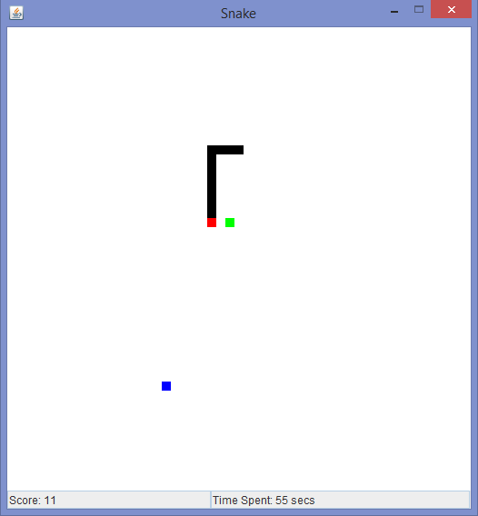

[![License][s2]][li]

[s1]: https://travis-ci.org/matt77hias/Snake.svg?branch=master
[s2]: https://img.shields.io/badge/license-GPL%203.0-blue.svg

[tr]: https://travis-ci.org/matt77hias/Snake
[li]: https://raw.githubusercontent.com/matt77hias/Snake/master/LICENSE.txt

# Snake

## About
A tribute to the Snake games provided for the TI84+ graphing calculator supporting no field boundaries, time independent blue tiles which enlarge the snake and time dependent green tiles which do not enlarge the snake.

This Snake game uses a correct timer for the game loop as explained in Andrew Davison's *Killer Game Programming in java*.

## Use

1. Run `Snake.jar`
2. Have Fun!
